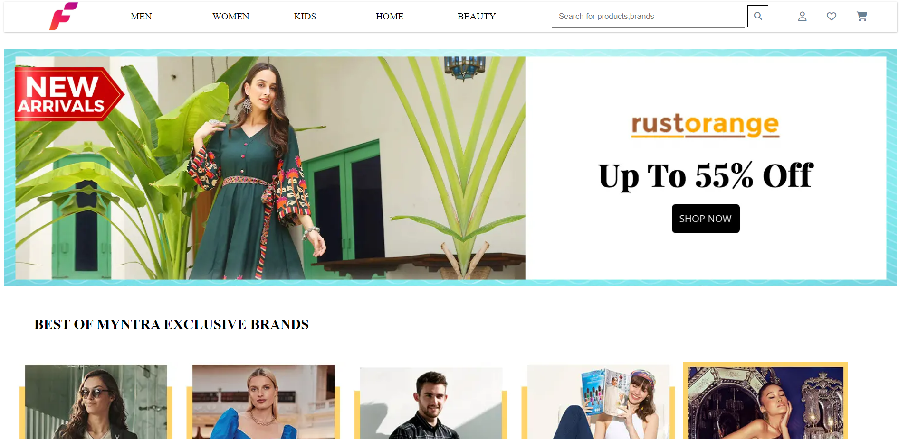
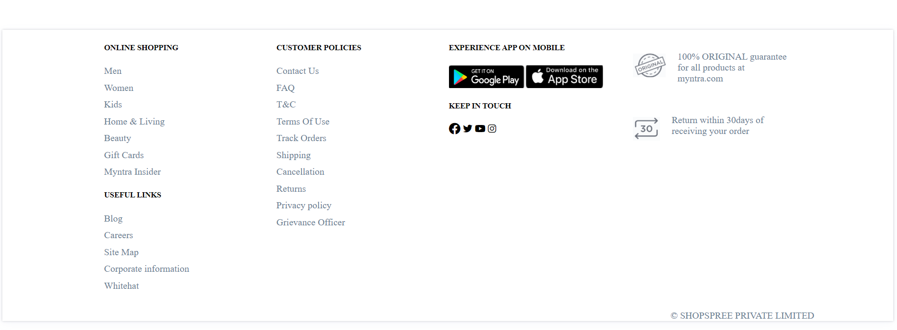
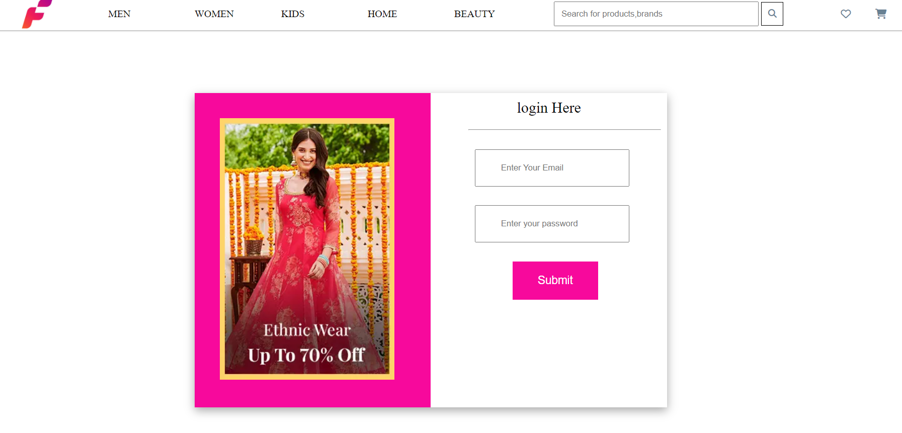
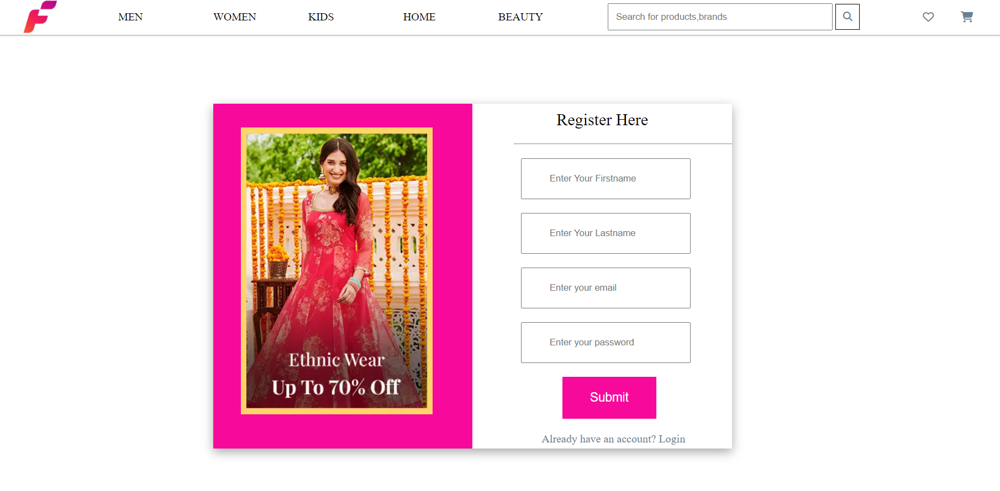
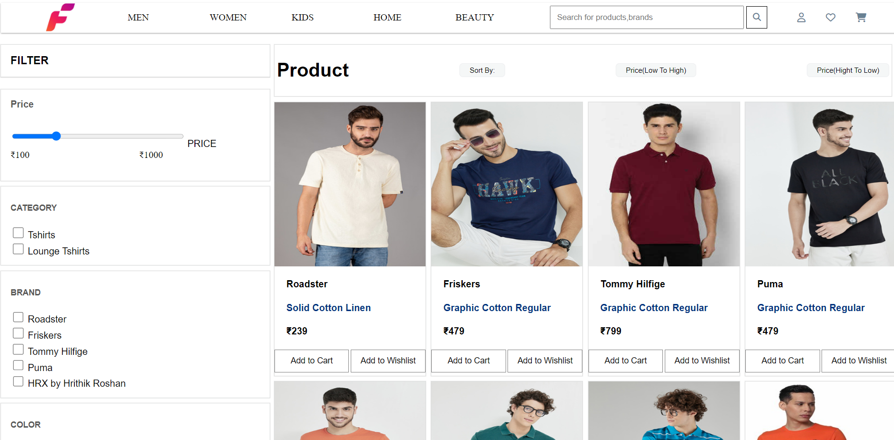
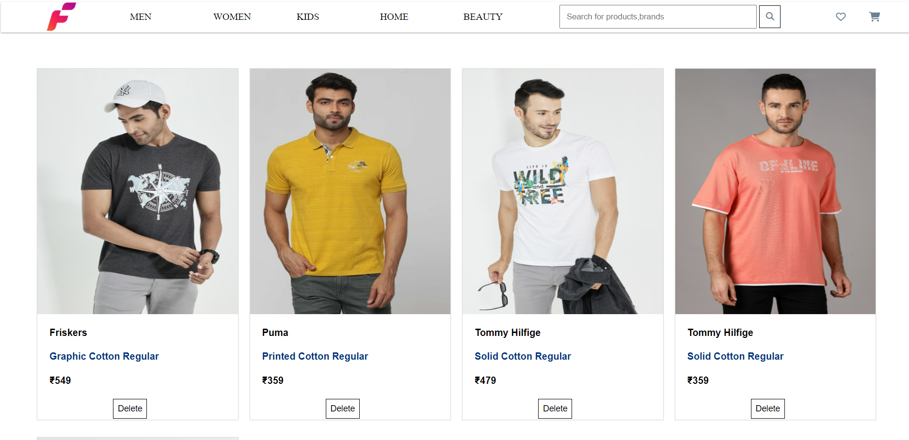
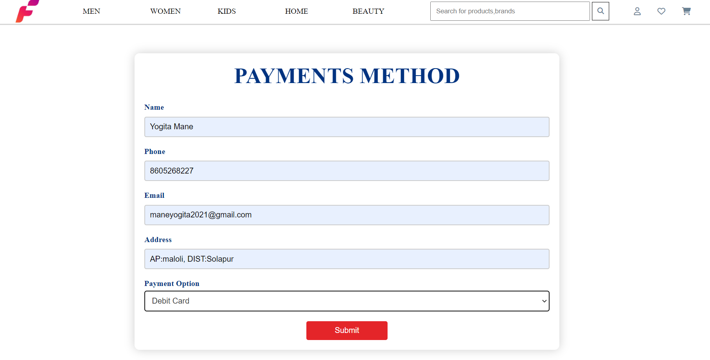
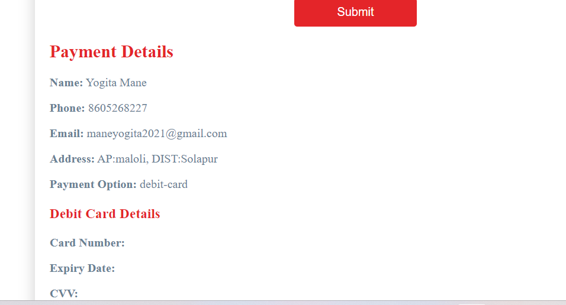

# [Fashionista]()

It's E-commerce website Where you can buy stuff
especially for Clothing stuff,It's clone of [myntra](https://www.myntra.com/?utm_source=dms_google&utm_medium=searchbrand_cpc&utm_campaign=dms_google_searchbrand_cpc_Search_Brand_Myntra_Brand_India_BM_TROAS_SOK&gclid=Cj0KCQjw9deiBhC1ARIsAHLjR2Ae40HF_2DoPBpsimPxx79jWjTn0H12H7yDLg0517svWESw5II7hi8aAhfuEALw_wcB) website.

** The Idea**

We are pursuing a Full Stack Web Development course at Masai school, In Masai school, we have given a project to clone myntra website. It was a pretty good project to work on. Let's look at how I designed it

Home Page 👇

Login Page 👇

Register Page 👇

Product page👇

Cart Page👇

Wishlish Page👇

Payment Page 👇

Payment Confirmation👇

## 🛠 Tools

1. HTML
2. CSS
3. Javascript
4. Node.js
5. Express
6. MongoDB

## Features

1. login
2. Signin
3. Add to Cart
4. Filter & Sort
5. Search Functionality
6. Add to wishlist
7. Payment Page

## FAQ

#### Can We login or logout ??

Yes, You Can login or logout

#### Can we add to Cart without login

No, You Can't, first Have to login

#### Can I Use Debit Card For Payment

Of Course, You Can also use COD and even Debit Card

#### Is it responsing or not ??

Yes, It's totally responsive

## Support

For support, email maneyogita2021@gmail.com or join our Slack channel.
